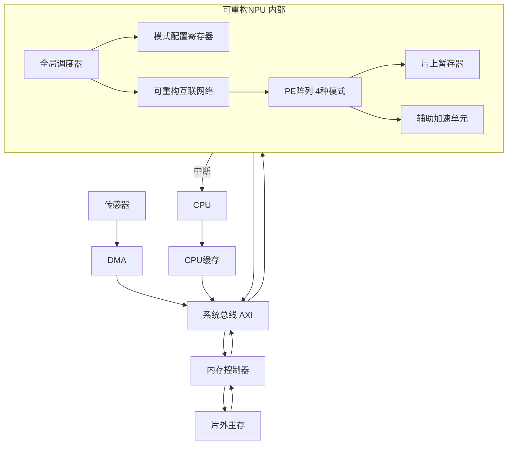

# hello-world
# 我的 NPU 系统架构图

... (一些描述文字) ...

```mermaid
flowchart TD
    SENSOR[传感器] --> DMA
    DRAM[片外主存] --> MEMCTRL[内存控制器]
    MEMCTRL --> BUS[系统总线 AXI]
    DMA --> BUS
    CPU --> CACHE[CPU缓存] --> BUS
    BUS --> NPU[可重构NPU]
    NPU --> BUS
    BUS --> MEMCTRL --> DRAM
    NPU -- 中断 --> CPU

    subgraph NPU [可重构NPU 内部]
        SCHED[全局调度器]
        CONFIG[模式配置寄存器]
        RECONN[可重构互联网络]
        PE[PE阵列 4种模式]
        SCRATCH[片上暂存器]
        ACC[辅助加速单元]
        SCHED --> CONFIG
        SCHED --> RECONN
        RECONN --> PE
        PE --> SCRATCH
        PE --> ACC
    end
```
